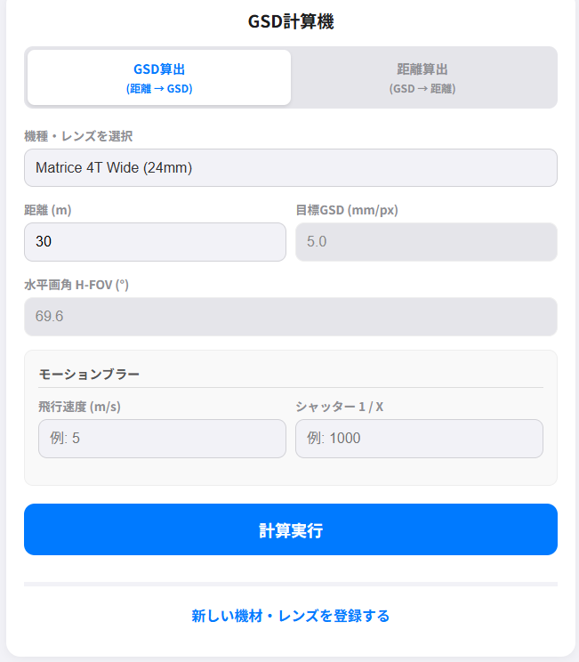
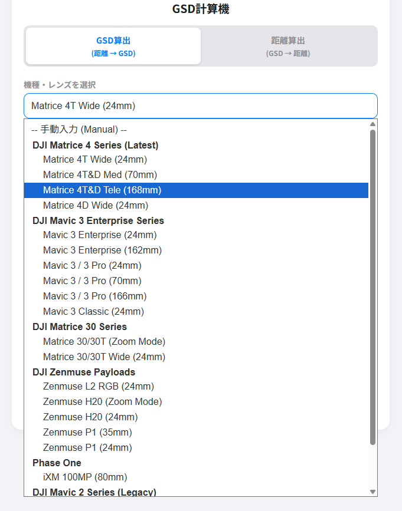
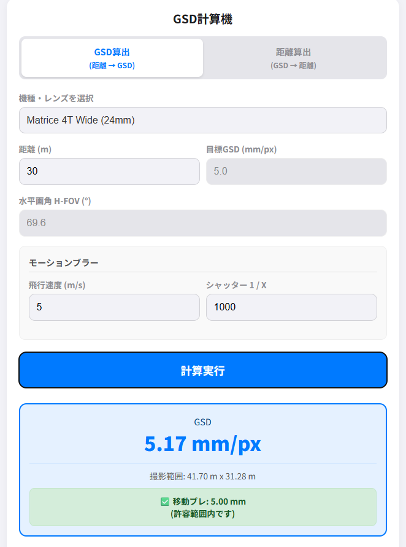

# GSD Calc (Ground Sample Distance Calculator)

ドローン測量・空撮のための、地上画素寸法 (GSD) 計算ツールです。 
現場でスマホから手軽に、正確なGSDや必要な飛行高度を計算できます。

  

## 特徴 (Features)

* **2つの計算モード**
    * **GSD算出:** 飛行高度から GSD (精度) を計算
    * **距離算出:** 目標とする GSD から必要な飛行高度を逆算
* **豊富なプリセット**
    * DJI Matrice 30/300/400シリーズ、Mavic 3 Enterprise、Zenmuse L2/P1/H20 など、主要な測量・産業用ドローンのスペックを網羅。
* **ズームレンズへの対応**
    * Mavic 2 Enterprise や H20/M30 シリーズの光学ズーム使用時の GSD 計算に対応。
* **モーションブラー計算**
    * 飛行速度とシャッタースピードから「移動ブレ」を計算し、許容範囲内かどうかを判定。
* **カスタム機材登録**
    * 手持ちの機材や新しいレンズを手動で登録・保存可能。
* **オフライン対応**
    * 電波の届かない山間部の現場でもブラウザさえあれば動作可能。

---

## 対応機種リスト (Preset Drones)

<strong>クリックしてリストを表示 / Hide List</strong>

### DJI Matrice 4 Series (Latest)
* Matrice 4T Wide (24mm)
* Matrice 4T&D Med (70mm)
* Matrice 4T&D Tele (168mm)
* Matrice 4D Wide (24mm)

### DJI Mavic 3 Enterprise Series
* Mavic 3 Enterprise (24mm / 162mm)
* Mavic 3 / 3 Pro (24mm / 70mm / 166mm)
* Mavic 3 Classic

### DJI Matrice 30 Series
* Matrice 30/30T (Zoom Mode / Wide)

### DJI Zenmuse Payloads
* Zenmuse L2 RGB
* Zenmuse H20 (Zoom / Wide)
* Zenmuse P1 (35mm / 24mm)

### Others
* Phase One iXM 100MP
* Mavic 2 Enterprise / Zoom / Pro (Legacy)

---

## 使い方 (Usage)

### 1. ブラウザで開く
アプリのURLにアクセスします。

  

### 2. 機材を選択
リストから使用するドローン・カメラを選択します。（または手動入力）

  

### 3. 計算モード選択 & 結果確認
* **「GSD算出」:** 飛行予定の高度を入力。
* **「距離算出」:** 欲しい精度 (例: 5.0 mm/px) を入力。
* 結果として、GSD、撮影範囲、モーションブラー判定が表示されます。

  

